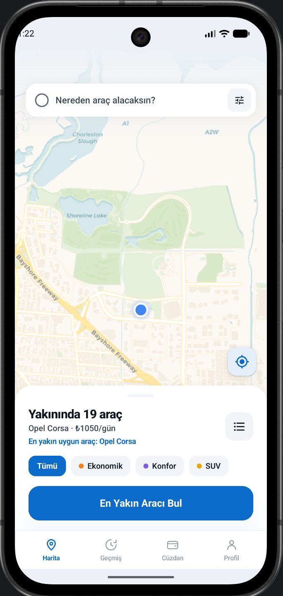
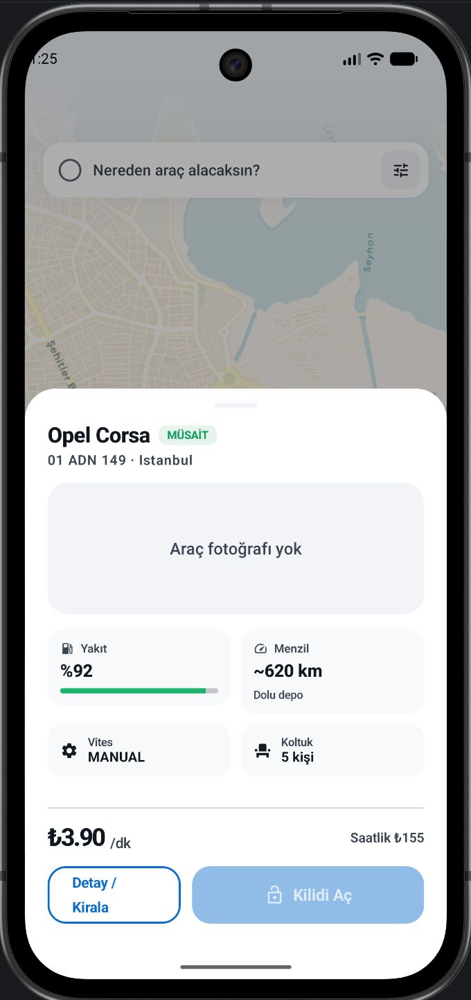
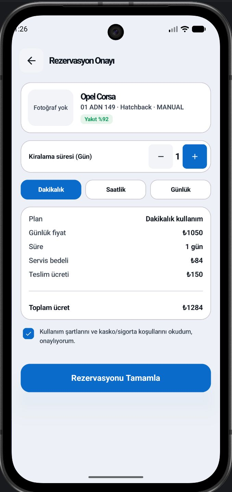
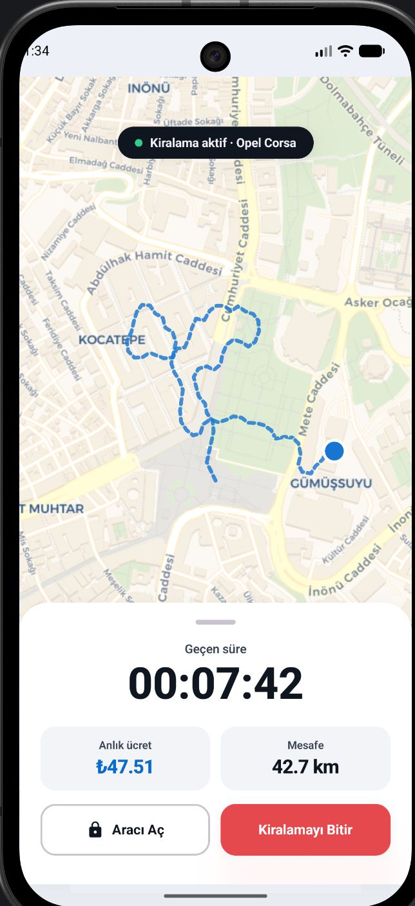
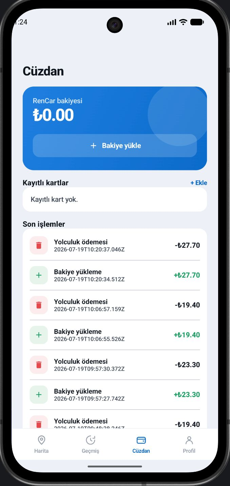
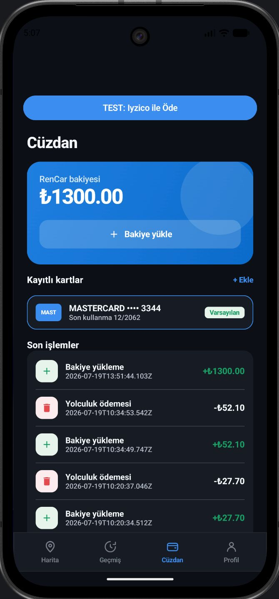
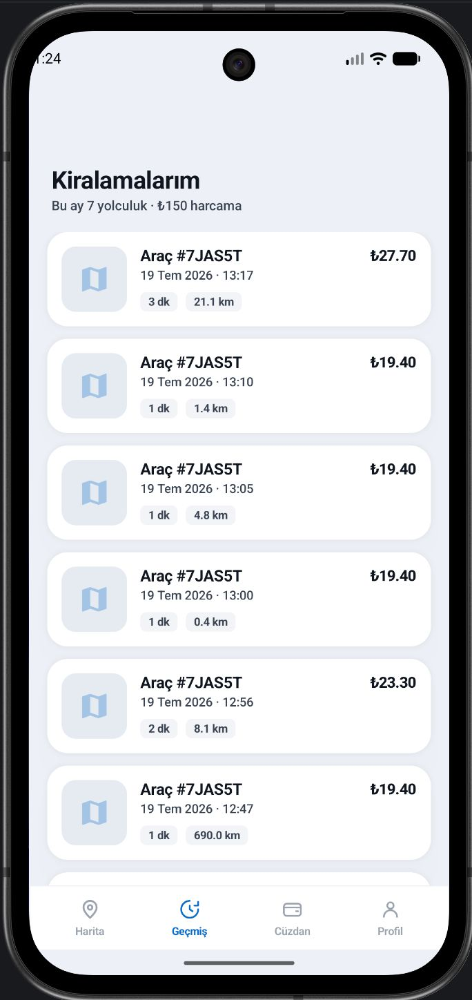
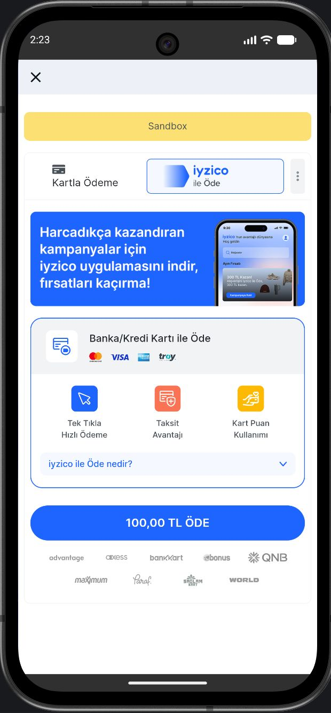
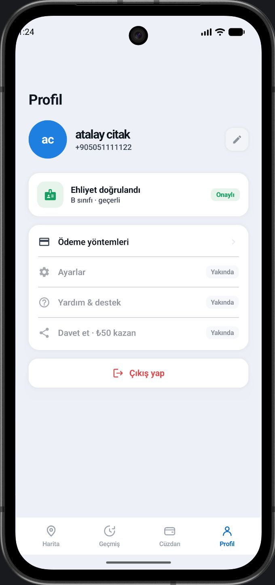

# RenCar

RenCar, kullanıcıların harita üzerinden yakındaki araçları bulup rezervasyon oluşturabildiği, teslim kontrolünden sonra aktif yolculuğa geçebildiği ve kiralama sonunda cüzdan/kart ödeme akışına ulaşabildiği Android araç kiralama uygulamasıdır.

Bu proje bizim bitirme projemiz olarak geliştirildi. Amacımız sadece ekranları göstermek değil, bir araç kiralama uygulamasında beklenen ana süreci uçtan uca çalışan bir mobil deneyim haline getirmekti. Bu yüzden uygulamayı harita, rezervasyon, aktif kiralama, ödeme, geçmiş, profil ve tema desteğiyle birlikte ele aldık.

**Takım Üyeleri**

- Zeynep Özkan
- Atalay Çıtak

## Projenin Kısa Özeti

RenCar'da kullanıcı önce giriş veya kayıt adımlarını tamamlar. Daha sonra harita ekranında kendisine yakın araçları görür, araç seçer, detay ve rezervasyon adımlarına ilerler. Kiralama başlamadan önce teslim kontrolü yapılır. Yolculuk başladıktan sonra süre, ücret, mesafe ve rota bilgisi takip edilir. Kiralama tamamlandığında kullanıcı ödeme ekranına yönlendirilir.

Bu akışı kurarken özellikle üç noktaya odaklandık:

- Harita merkezli gerçek bir kiralama deneyimi oluşturmak
- Ekranlar arasında seçilen araç ve kiralama bilgisini kaybetmeden ilerlemek
- UI tarafını, API entegrasyonunu ve state yönetimini sürdürülebilir bir mimariyle bağlamak

## Ekran Görüntüleri

| Ana Harita | Araç Detayı | Rezervasyon |
| :---: | :---: | :---: |
|  |  |  |

| Aktif Kiralama | Cüzdan | Koyu Tema Cüzdan |
| :---: | :---: | :---: |
|  |  |  |

| Geçmiş | Iyzico WebView Denemesi | Profil |
| :---: | :---: | :---: |
|  |  |  |

## Kullanıcı Akışı

```text
Splash
-> Onboarding
-> Login / Register
-> OTP doğrulama
-> Ehliyet kontrolü
-> Harita
-> Araç detay
-> Rezervasyon
-> Teslim kontrolü
-> Aktif yolculuk
-> Kiralama özeti
-> Ödeme
-> Geçmiş / Cüzdan / Profil
```

Kullanıcı uygulamaya tekrar girdiğinde kayıtlı oturum kontrol edilir. Kullanıcının rolüne ve mevcut kiralama durumuna göre harita, ehliyet kontrolü, teslim kontrolü veya aktif yolculuk gibi doğru ekrana yönlendirme yapılır.

## Projede Odaklandığımız Noktalar

### Harita Odaklı Kiralama Deneyimi

Uygulamanın merkezine harita ekranını aldık. Araçlar MapLibre üzerinde marker olarak gösteriliyor. Kullanıcı marker seçtiğinde altta araç bilgilerini içeren bir kart açılıyor ve bu kart üzerinden detay ya da rezervasyon adımına geçilebiliyor.

Harita ekranını sadece araçları listeleyen bir alan olarak düşünmedik. Kullanıcının konumu, araçların konumu, aktif rezervasyon ve aktif kiralama bilgisi aynı state içinde değerlendirilerek ekranın ne göstermesi gerektiği belirleniyor.

### Konuma Göre Araç Filtreleme

Araç filtreleme mantığını doğrudan ekran içinde tutmak yerine `FilterHomeVehiclesUseCase` içine aldık. Bu use case içinde araç tipi, fiyat, menzil, aktif rezervasyon ve kullanıcı konumu birlikte değerlendiriliyor.

Kullanıcı konumu varsa araçla arasındaki mesafe haversine formülüyle hesaplanıyor. Daha sonra yaklaşık yürüme süresine göre 15 dakika içinde erişilebilir araçları göstermeye çalışıyoruz. Böylece ana ekranı, kullanıcının konumunu dikkate alan daha anlamlı bir araç keşif ekranı haline getirdik.

### Uçtan Uca Kiralama Akışı

Projede ana harita ve araç kartını, devam eden kiralama adımlarıyla birlikte ele aldık. Kullanıcı seçtiği araçla detay ekranına, oradan rezervasyon ekranına, sonrasında teslim kontrolüne ve aktif yolculuğa ilerleyebiliyor.

Bu akışta `vehicleId` ve `rentalId` gibi bilgiler navigation route'larıyla taşınıyor. Böylece kullanıcı farklı ekranlara geçse bile hangi araç veya kiralama üzerinde işlem yaptığı korunuyor.

### Teslim Kontrolü ve Aktif Yolculuk

Kiralama başlamadan önce teslim kontrol ekranı ekledik. Bu ekran, aracın teslim alınmadan önce kontrol edilmesi fikrine dayanıyor. Aktif yolculuk ekranında ise süre, ücret, mesafe ve rota bilgisi birlikte gösteriliyor.

Aktif yolculukta route points listesi harita üzerinde çiziliyor. Socket üzerinden araç konumu dinleme altyapısı da `RenCarSocketClient` ile hazırlandı. Demo akışta rota simülasyonu kullanılıyor; socket tarafı gerçek zamanlı konum verisi geldiğinde kullanılabilecek şekilde ayrılmış durumda.

### Ödeme ve Cüzdan Deneyimi

Kiralama bittikten sonra kullanıcı kiralama özeti ekranına gidiyor. Burada toplam tutar, cüzdan bakiyesi, kayıtlı kartlar ve ödeme yöntemi birlikte gösteriliyor.

Cüzdan bakiyesi yeterliyse kullanıcı cüzdan ile ödeme yapabiliyor. Bakiye yetersizse bakiye yükleme veya kartla ödeme seçenekleri gösteriliyor. Cüzdan ekranında bakiye, kayıtlı kartlar ve son işlemler ayrı bölümler halinde sunuluyor.

Iyzico için WebView tabanlı ayrı bir deneme akışı da hazırladık. Bu akış ana ödeme sürecinden izole tutuldu; cüzdan ekranındaki test butonu üzerinden ödeme sayfasının uygulama içinde açılması ve sonucunun yakalanması denenebiliyor.

### Açık/Koyu Tema Desteği

Uygulamada açık ve koyu tema desteği bulunuyor. Renkleri ekranların içine tek tek yazmak yerine Compose tema yapısı ve `MaterialTheme.colorScheme` üzerinden yönetmeye çalıştık.

Ayarlar ekranında tema seçimi yapılabiliyor. Seçilen tema `ThemeManager` içindeki `StateFlow` ile tutuluyor ve `MainActivity` bu state'e göre uygulamayı açık, koyu veya sistem temasına göre güncelliyor.

### Gerçek API ve Fake Repository Desteği

Projede gerçek API'ye bağlanan repository'ler ile geliştirme/test için kullanılan fake repository'leri birlikte tuttuk. `BuildConfig.USE_FAKE_REPOSITORIES` değerine göre Koin tarafında hangi repository'nin kullanılacağı seçiliyor.

Bu yapı geliştirme sırasında esneklik sağladı. Backend hazır olmadığında ekranları fake data ile test edebildik; gerçek senaryoda ise aynı ekranları gerçek API repository'leriyle çalıştırabildik.

## Teknik Yapı

Projede MVI ve Clean Architecture yaklaşımını birlikte kullandık. Amacımız ekran kodunu, iş kurallarını ve veri kaynaklarını birbirinden ayırmaktı.

```text
Compose Screen
-> ViewModel
-> UseCase
-> Repository
-> Retrofit / DataStore / Socket
```

### Presentation Katmanı

Bu katmanda Compose ekranları, ViewModel'ler, navigation route'ları ve ortak UI bileşenleri bulunuyor.

Ekran state'leri `BaseMviViewModel` üzerinden `MutableStateFlow` ile tutuluyor. UI tarafı bu state'i dinliyor ve state değiştikçe yeniden çiziliyor. Snackbar, navigation veya tek seferlik mesajlar için `Channel` tabanlı effect yapısı kullanılıyor.

### Domain Katmanı

Domain katmanında model sınıfları, repository arayüzleri ve use case'ler bulunuyor. Örneğin araç filtreleme, kiralama bitirme, ödeme use case'leri ve repository sözleşmeleri bu katmanda yer alıyor.

Bu katman sayesinde ekran tarafı doğrudan API detaylarını bilmek zorunda kalmıyor. ViewModel sadece hangi use case'i çağıracağını biliyor.

### Data Katmanı

Data katmanında Retrofit servisleri, DTO'lar, repository implementasyonları, DataStore yönetimi ve Socket.IO bağlantısı bulunuyor.

`RenCarApi` içinde backend endpointleri tanımlandı. API cevaplarını her repository içinde tekrar tekrar kontrol etmemek için `safeApiCall` kullandık. Başarılı cevapları `NetworkResult.Success`, başarısız cevapları `NetworkResult.Error` olarak yönetiyoruz.

Oturum tarafında access token, refresh token ve kullanıcı id bilgisi `DataStoreManager` ile saklanıyor. 401 durumlarında `TokenExpiredAuthenticator` refresh token ile yeni access token almaya çalışıyor. Aynı anda birden fazla refresh isteği oluşmaması için `Mutex` kullanıldı.

## Kullanılan Teknolojiler

- Kotlin
- Jetpack Compose
- Material 3
- Navigation Compose
- MVI
- Clean Architecture
- Koin
- Retrofit
- OkHttp
- Kotlinx Serialization
- DataStore
- Coroutines
- StateFlow
- MapLibre
- Socket.IO
- CameraX
- JUnit

## API Entegrasyonu

Backend entegrasyonunda RenCar API dokümanı temel alındı:

[RenCar API Docs](https://rencarv2.halitkalayci.com/api/docs#)

Projede kullandığımız ana endpoint grupları:

- `POST /auth/login`
- `POST /auth/verify-otp`
- `GET /auth/me`
- `GET /vehicles`
- `GET /vehicles/{id}`
- `GET /reservations/active`
- `POST /reservations`
- `POST /rentals`
- `GET /rentals/active`
- `POST /rentals/{id}/photos`
- `POST /rentals/{id}/start`
- `POST /rentals/{id}/finish`
- `POST /rentals/{id}/pay`
- `GET /wallet`
- `POST /wallet/topup`
- `GET /cards`
- `POST /cards`

## Proje Klasörleri

```text
app/src/main/java/com/example/rencar_pair
├── data
│   ├── local
│   ├── remote
│   ├── repository
│   └── socket
├── di
├── domain
│   ├── location
│   ├── model
│   ├── repository
│   └── usecase
└── presentation
    ├── mvi
    ├── navigation
    └── ui
        ├── components
        └── screens
```

Öne çıkan ekranlar:

- `home`: Harita ve araç seçimi
- `vehicle`: Araç detay ekranı
- `reservation`: Rezervasyon oluşturma
- `delivery`: Teslim kontrolü
- `active_rental`: Aktif yolculuk takibi
- `trip_summary`: Kiralama özeti ve ödeme
- `wallet`: Cüzdan, kartlar ve son işlemler
- `history`: Kiralama geçmişi
- `profile`: Profil ekranı
- `settings`: Tema ve ayarlar
- `referral`: Referans ekranı

## Testlerde Kontrol Ettiklerimiz

ViewModel testlerinde özellikle state geçişlerine ve kullanıcı aksiyonlarının doğru sonuç üretip üretmediğine odaklandık.

Kontrol edilen başlıca alanlar:

- Ana ekranda araç filtreleme ve seçili araç state'i
- Rezervasyon sonrası doğru ekrana geçiş
- Teslim kontrolü sonrası aktif yolculuk akışı
- Aktif kiralamada süre, ücret, mesafe ve bitirme davranışı
- Kiralama bitince ödeme ekranına geçiş
- Cüzdan bakiyesi, kart seçimi ve ödeme hareketleri

Testleri çalıştırmak için:

```powershell
.\gradlew.bat testDebugUnitTest
```

## Projeyi Çalıştırma

Projeyi Android Studio ile açtıktan sonra Gradle sync yapılır. Debug build için:

```powershell
.\gradlew.bat compileDebugKotlin
```

Emülatöre kurmak için:

```powershell
.\gradlew.bat installDebug
```

macOS veya Linux için:

```bash
./gradlew compileDebugKotlin
```

## Son Durum

RenCar şu anda araç kiralama sürecinin ana adımlarını uçtan uca gösterebilen bir Android istemcisidir. Harita üzerinden araç seçimi, rezervasyon, teslim kontrolü, aktif yolculuk, kiralama özeti, cüzdan/kart ödeme akışı, geçmiş, profil ve tema desteği tek uygulama akışı içinde bir araya getirilmiştir.
