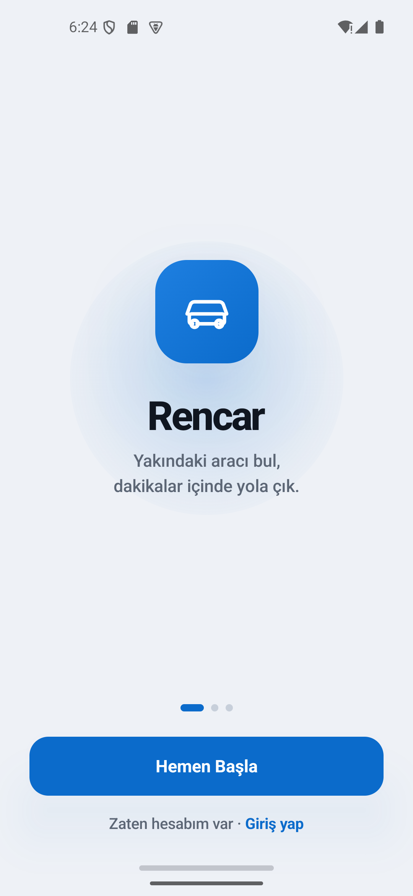
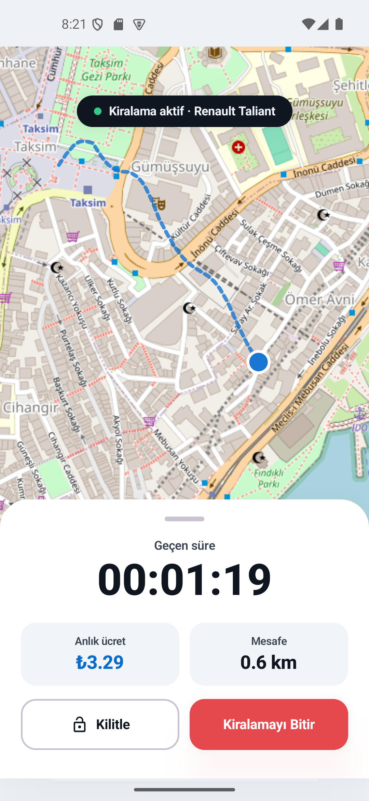

# RenCar

RenCar, yakındaki uygun aracı harita üzerinden bulup kısa sürede kiralama akışını tamamlamayı hedefleyen bir Android bitirme projesidir. Projede amacımız sadece ekranları göstermek değil, kullanıcının uygulamaya ilk girişinden ödeme adımına kadar ilerleyebildiği gerçekçi ve uçtan uca bir mobil deneyim oluşturmaktı.

**Takım Üyeleri**

- Zeynep Özkan
- Atalay Çıtak

## Ekran Görüntüleri

| Onboarding | Aktif Kiralama |
| --- | --- |
|  |  |

## Projenin Amacı

RenCar ile kullanıcıların yakınındaki araçları harita üzerinde görmesini, uygun aracı seçmesini, rezervasyon oluşturmasını, teslim öncesi araç fotoğraflarını yüklemesini, aktif yolculuğunu takip etmesini ve kiralama sonunda ödeme adımına geçmesini sağladık.

Bu süreçte özellikle gerçek bir araç kiralama uygulamasında beklenen akışa yaklaşmaya çalıştık. Kullanıcıyı karışık veya yarım kalmış ekranlara yönlendirmek yerine, adımların sırayla ve anlaşılır ilerlemesine dikkat ettik.

## Geliştirme Odağımız

Bu projede en çok önem verdiğimiz nokta, kullanıcının uygulama içinde kaybolmadan ilerleyebilmesiydi. Bu yüzden ekranları tek tek hazırlamanın yanında, bu ekranların birbirine doğru sırayla bağlanmasına da özellikle dikkat ettik.

Kullanıcının önce ana haritada yakınındaki araçları görmesini, sonra gerçekten seçtiği araçla detay ve rezervasyon adımlarına ilerlemesini hedefledik. Kiralama başladıktan sonra da aktif yolculuk ekranında süre, ücret, mesafe ve rota bilgisinin anlaşılır şekilde takip edilebilmesini istedik.

API tarafında da sadece ekrana veri basmakla kalmadık. Araç listeleme, aktif rezervasyon, aktif kiralama, kiralama başlatma, kiralama bitirme ve ödeme akışlarının backend dokümanındaki endpointlerle uyumlu olmasına dikkat ettik. Böylece uygulama hem görsel olarak prototipe yaklaştı hem de gerçek servislerle daha tutarlı çalışacak hale geldi.

## Neler Yaptık?

Öncelikle kullanıcının uygulamaya girişten sonra doğrudan aktif kiralama ekranına yönlenmesini engelledik. İlk karşılaşılan ekranın ana harita ve yakındaki araçlar ekranı olmasını sağladık.

Ana ekrandaki araç gösterimini daha anlamlı hale getirdik. Araçları 15 dakikalık yakınlık kuralına göre filtreledik, kategori seçimlerini toparladık ve marker seçildiğinde kullanıcının hangi aracı seçtiğini daha net görebileceği bir kart yapısı oluşturduk.

Araç seçimi sonrası akışı seçilen gerçek araç üzerinden bağladık. Kullanıcı artık araç kartındaki Detay / Kirala butonu ile araç detay ekranına, oradan rezervasyon onayına, ardından teslim öncesi fotoğraf kontrolüne ve aktif yolculuk ekranına ilerleyebiliyor.

Aktif yolculuk ekranında rota çizimini de iyileştirdik. Daha doğal görünen, mavi tonlu, kesikli ve üst üste binmeyen bir rota simülasyonu hazırladık. Böylece yolculuk ekranı demo hissinden biraz daha uzaklaşıp canlı takip ekranına daha yakın bir hale geldi.

Kiralama bitirme kısmında API dokümanına göre doğru endpoint kullanımını düzenledik. Normal kiralama bitirme akışında `POST /rentals/{id}/finish` endpoint'ini kullandık. Eski `return` endpoint'ini ise yalnızca gerekli olan geri uyumluluk senaryosu için bıraktık.

Ödeme ve cüzdan tarafında kullanıcının kiralama bitince ödeme ekranına ulaşabilmesi, cüzdan/kart seçimlerini daha düzgün yapabilmesi ve ödeme sonrası ana ekrana dönebilmesi için akışı toparladık.

Son olarak MapLibre kaynaklı siyah ekran riskini azaltmak için harita bileşeninde render ayarını güncelledik. Font dosyalarından kaynaklanan yükleme hatalarını da kaldırarak uygulamanın ilk açılışını daha stabil hale getirdik.

## Öne Çıkan Detaylar

- Proje sadece statik ekranlardan oluşmuyor; login, araç seçimi, rezervasyon, fotoğraf kontrolü, aktif yolculuk ve ödeme adımları birbirine bağlı ilerliyor.
- Harita tarafında MapLibre kullanıldı ve araç marker'ları kullanıcı deneyiminin merkezine alındı.
- Araçların gösteriminde 15 dakikalık yakınlık kuralı dikkate alındı.
- Seçilen araç bilgisinin kaybolmaması için detay ve rezervasyon ekranları aynı araç üzerinden ilerleyecek şekilde düzenlendi.
- Kiralama bitirme hatası API dokümanına göre doğru endpoint kullanılarak çözüldü.
- Aktif yolculuk ekranında rota çizimi rastgele ama doğal ilerleyen bir simülasyon gibi çalışacak şekilde iyileştirildi.
- UI metinlerinde daha anlaşılır ve kullanıcıya yakın Türkçe ifadeler tercih edildi.
- MVI ve Clean Architecture yapısı korunarak ekran, ViewModel, use case ve repository sorumlulukları ayrıldı.
- Değişiklikler sadece görsel düzeltme olarak bırakılmadı; ilgili ViewModel testleri de yeni akışa göre güncellendi.

## Kullanıcı Akışı

1. Kullanıcı onboarding ekranını görür.
2. Telefon numarası ile giriş yapar ve OTP doğrulamasını tamamlar.
3. Ana harita ekranında yakındaki uygun araçları görür.
4. Haritadaki marker'lardan veya karttan araç seçer.
5. Detay / Kirala ile araç detay ekranına gider.
6. Rezervasyon onayı ekranında plan seçer ve şartları onaylar.
7. Teslim öncesi 4 yön fotoğraf kontrolünü tamamlar.
8. Aktif yolculuk ekranında süre, ücret, mesafe ve rota bilgisini takip eder.
9. Kiralamayı bitirirken onay alır.
10. Kiralama tamamlanınca ödeme ekranına geçer.
11. Cüzdan veya kart ile ödeme yapıp ana ekrana döner.

## Teknik Yapı

Projede Android tarafında modern ve sürdürülebilir bir yapı kurmaya çalıştık.

- **Kotlin** ile geliştirildi.
- **Jetpack Compose** ile ekranlar oluşturuldu.
- **MVI mimarisi** ile ekran state, intent ve effect yapıları ayrıldı.
- **Clean Architecture** yaklaşımıyla presentation, domain ve data katmanları ayrıldı.
- **Koin** ile dependency injection yapıldı.
- **Retrofit** ve **Kotlinx Serialization** ile API iletişimi kuruldu.
- **MapLibre** ile harita, marker ve rota gösterimi sağlandı.
- **DataStore** ile oturum/token gibi veriler yönetildi.
- **JUnit** ve coroutine test araçlarıyla ilgili ViewModel testleri yazıldı/güncellendi.

## API Entegrasyonu

Backend entegrasyonunda API dokümanı temel alındı:

[RenCar API Docs](https://rencarv2.halitkalayci.com/api/docs#)

Özellikle şu akışlara dikkat edildi:

- `POST /auth/login`
- `POST /auth/verify-otp`
- `GET /auth/me`
- `GET /vehicles`
- `GET /reservations/active`
- `POST /rentals`
- `GET /rentals/active`
- `POST /rentals/{id}/finish`

Kiralama bitirme işleminde plan tipine göre yanlış endpoint'e gitme problemi kontrol edildi. Normal aktif yolculuk bitirme senaryosu için `finish` endpoint'i kullanıldı.

## Proje Yapısı

```text
app/src/main/java/com/example/rencar_pair
├── data
│   ├── remote
│   └── repository
├── di
├── domain
│   ├── model
│   ├── repository
│   └── usecase
└── presentation
    ├── navigation
    └── ui
        ├── components
        └── screens
```

Bu yapıda ekranlar doğrudan API çağırmıyor. Kullanıcı aksiyonları önce ViewModel'e gidiyor, ViewModel use case'leri çağırıyor, repository katmanı da API veya fake data tarafını yönetiyor.

## Kurulum ve Çalıştırma

Projeyi Android Studio ile açtıktan sonra Gradle sync yapılır. Ardından debug build alınabilir:

```bash
./gradlew compileDebugKotlin
```

Windows için:

```powershell
.\gradlew.bat compileDebugKotlin
```

Emülatöre kurmak için:

```powershell
.\gradlew.bat installDebug
```

## Test

Bu geliştirme sırasında özellikle ana ekran ve aktif kiralama akışını etkileyen ViewModel testleri güncellendi.

Çalıştırılan temel kontroller:

```powershell
.\gradlew.bat compileDebugKotlin
.\gradlew.bat testDebugUnitTest
.\gradlew.bat installDebug
```

Özellikle kontrol edilen test alanları:

- Home ekranı ve araç filtreleme state'leri
- Harita üzerinde seçilen araç davranışı
- Aktif kiralama ekranındaki rota, süre, ücret ve bitirme akışı
- Rezervasyon ve teslim öncesi fotoğraf akışı
- Kiralama bitişinden sonra ödeme ekranına geçiş

